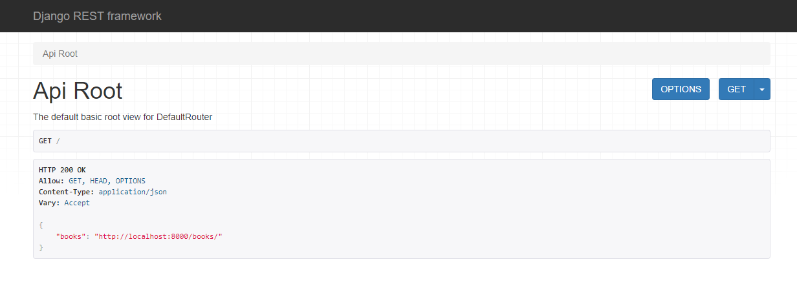
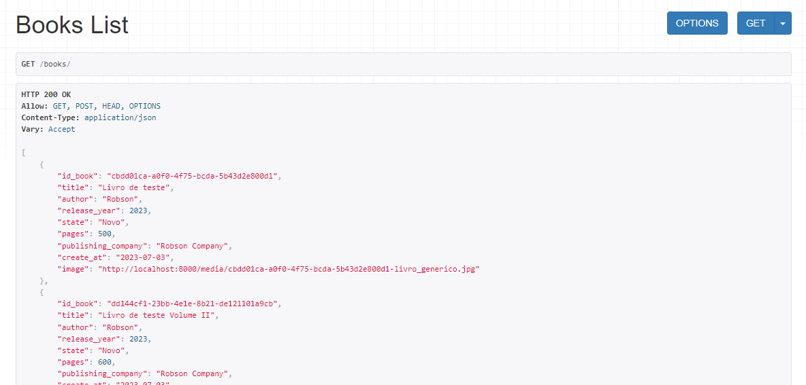

# RESTful-API-Django
Crie de forma rápida uma API RESTful utilizando Django e Django Rest Framework 

<b>É necessário ter conhecimentos básicos de Django para usar esse tutorial (Criar projeto e criar app)</b>

# Siga o passo a passo para criar a sua API.

<h2>1 - Crie uma pasta chamada projeto e dentro dela cria uma pasta chamada library</h2>

<h2>2 - Pelo terminal da sua IDE entre na pasta library e crie uma nova venv pelo comando:
   
 
 python -m venv venv</h2>

<h2>3 - Ative a sua venv (venv/Scripts/Activate)</h2>

<h2>4 - Dentro da pasta library, instale o Django / Django Rest Framework pelo comando:
   
pip install django djangorestframework</h2>

<h2>5 - Dentro da pasta library, crie um novo projeto do Django pelo comando:
  
django-admin startproject library</h2>

<h2>6 - Dentro da pasta library, crie um app chamado books pelo comando:
  
django-admin startapp books</h2>

<h2>7 - Execute o comando a seguir para fazer o migrate do Django:
  
python manage.py migrate</h2>

<h2>8 - Copie o código do arquivo settings.py deste repositorio (/library/settings.py) para o seu settings.py, cuidado com a sua secret key</h2>

<h2>9 - Copie o código do arquivo models.py deste repositorio (/books/models.py) para o seu models.py</h2>

<h2>10 - Copie a pasta /books/api deste repositorio para o seu /books</h2>

<h2>11 - Copie o código do arquivo urls.py deste repositorio (/library/urls.py) para o seu urls.py</h2>

<h2>12 - Execute o comando a seguir para instalar a biblioteca pillow:
  
pip install pillow</h2>

<h2>13 - Execute o comando a seguir para fazer o make migrations:
  
python manage.py makemigrations</h2>

<h2>14 - Execute o comando a seguir para fazer o migrate:
  
python manage.py migrate</h2>

<h2>15 - Execute o comando a seguir para abrir o projeto no seu navegador pela porta 8000 (ative a sua venv se não estiver ativa):
  
python manage.py runserver</h2>

<h2>16 - Acesse http://localhost:8000/ e utilize a API.</h2>

